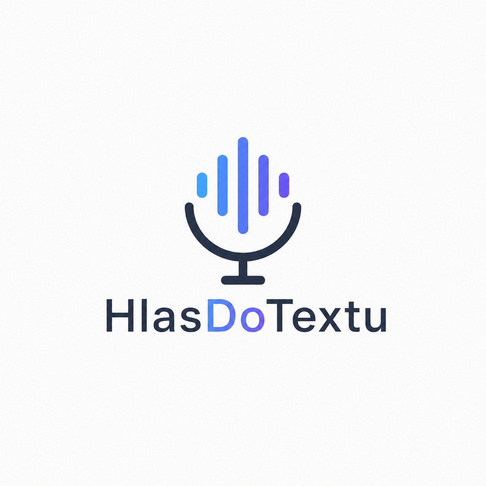
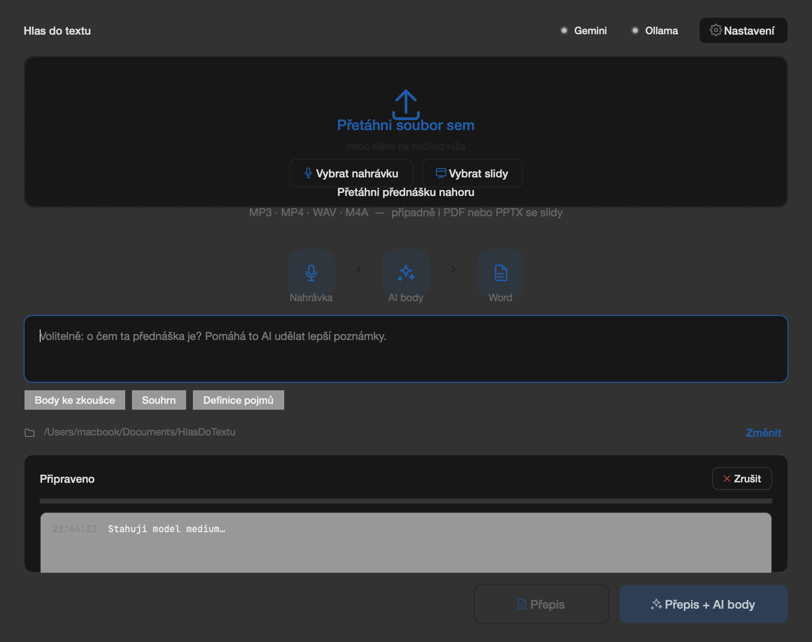
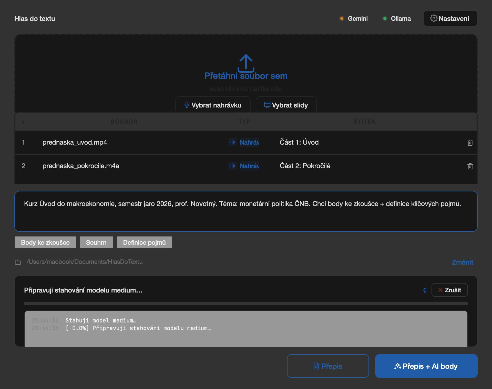

<div align="center">
  
</div>

# Hlas do textu

> Desktop aplikace pro studenty, učitele a finanční poradce — z nahrávky
> přednášky, vyučovací hodiny nebo schůzky s klientem vyrobí strukturovaný
> Word dokument, který se hodí k danému použití (studijní body, otázky ke
> zkoušení, zápis ze schůzky, follow-up e-mail…).

[](https://github.com/matczalas/hlas-do-textu/actions)
[](https://www.python.org)
[](https://www.qt.io)



## Pro koho

- **Student** — z přednášky vyrobí studijní materiál (hlavní body, klíčové
  pojmy, příklady, otázky se vzorovými odpověďmi), karty na učení
  (Anki / Quizlet) nebo slovíčka z hodiny jazyka.
- **Učitel** — z hodiny vyrobí poznámky pro nepřítomné žáky, otázky
  ke zkoušení (ústní / písemka / procvičování), souhrn pro rodiče,
  plán navazující hodiny nebo reflexi vlastního projevu.
- **Finanční poradce / Sales** — ze schůzky vyrobí zápis (úkoly s deadliny,
  profil klienta, termín další schůzky), hotový follow-up e-mail klientovi,
  zápis telefonátu, nebo koučovací zápis s námitkami klienta.
- **Rozhovory & Podcasty** — z epizody vyrobí show notes, kapitoly s časovými
  značkami, citáty pro sociální sítě, publikovatelný článek nebo rozhovor
  ve formátu otázka–odpověď.

## Co umí

- **Lokální přepis** mluveného slova v češtině (Whisper, offline)
- **Rychlý cloud přepis** přes Gemini Audio (~1 min na 15 min audia) — volitelné
- **AI strukturovaný výstup podle 29 šablon** — od studijního materiálu po
  follow-up e-mail. Každá šablona má vlastní strukturu sekcí (hlavní body,
  definice, otázky / odpovědi, klíč / hodnota, odstavce) a uživatel vidí
  v UI předem, co dostane.
- **Univerzální zápis ze schůzky** — pro libovolnou pracovní schůzku
  (účastníci, body, rozhodnutí, akce s vlastníky).
- **Brainstorming s názorem AI** — AI nejen přepíše, ale dá upřímnou zpětnou
  vazbu: co si o nápadech myslí, kritiku, vlastní návrhy a zhodnocení, jestli
  byla schůzka efektivní. (Jediná šablona, kde AI záměrně přidává vlastní názor.)
- **Rozlišování mluvčích** (cloud přepis) — u dialogu (sales schůzka, zápis ze
  schůzky) přepis označí „Mluvčí 1 / Mluvčí 2" a AI v dokumentu sama přiřadí
  role/jména, pokud je z kontextu pozná (Poradce, Klient Novák…).
- **Chat o dokumentu** — po vyrobení AI požádáš o úpravy („stručněji",
  „přidej otázky", „rozšiř kapitolu o příklady")
- **Dávka více nahrávek** — spojit do jednoho, nebo každou zvlášť
- **Automatické třídění** výstupů do složek podle tématu (Fyzika/, Dějepis/,
  Finance/…)
- **Vstup odkudkoli** — drag & drop, YouTube/Vimeo/podcast URL
- **Resume** — přerušený přepis naváže od místa, kde skončil
- **Offline fallback** přes Ollama (bez internetu)
- **Markdown export** připravený jako prompt pro ChatGPT / Claude / Gemini
- **Auto-update** přes GitHub Releases — nová verze sama naskočí

## Instalace

### Windows

1. Stáhni `HlasDoTextu-Setup-X.Y.Z.exe` z [Releases](https://github.com/matczalas/hlas-do-textu/releases)
2. Dvojklik. Při SmartScreen warning → *More info* → *Run anyway*
3. Klikej *Next* / *Install* (~30 s)
4. Spusť aplikaci, vlož aktivační klíč (formátu `S4F1-XXXX-XXXX-XXXX-XXXX`)
5. V uvítacím dialogu klikni *"Získat API klíč zdarma"* a vlož ho

### macOS

1. Stáhni `HlasDoTextu-X.Y.Z.dmg` z [Releases](https://github.com/matczalas/hlas-do-textu/releases)
2. Otevři DMG → přetáhni **Hlas do textu** do složky **Aplikace**
3. **První spuštění obejde Gatekeeper** (aplikace není notarizovaná u Apple — není to virus, jen za "ověření" Apple chce placený účet):

   **macOS 13–14 (Ventura, Sonoma):**
   - Pravým klikem na ikonu aplikace → **Otevřít** → v dialogu znovu **Otevřít**

   **macOS 15 (Sequoia) — pravý klik už nestačí:**
   - Dvojklik (objeví se varování "nebyl otevřen") → klikni **Hotovo**
   - Otevři **Systémové nastavení → Soukromí a zabezpečení**
   - Sjeď dolů → u hlášky o HlasDoTextu klikni **"Přesto otevřít"**

   **Když nic z toho nefunguje (jistý způsob přes Terminál):**
   ```bash
   xattr -dr com.apple.quarantine /Applications/HlasDoTextu.app
   ```
   Pak už jde aplikace otevřít normálně dvojklikem.
4. Vlož aktivační klíč

Toto varování uvidíš **jen jednou** — po prvním otevření si macOS aplikaci zapamatuje.

Detailní návod: [docs/PRVNI_SPUSTENI.md](docs/PRVNI_SPUSTENI.md)

## Použití

| | |
|---|---|
|  | Přetáhni nahrávku (mp3 / mp4 / wav / m4a) a volitelně slidy (PDF / PPTX), nebo vlož YouTube URL. V poli **„Co vyrobit"** vyber šablonu — pod dropdown se hned zobrazí, jaké sekce dokument bude mít. Do textarey nahoře doplň krátký kontext (jméno klienta, předmět hodiny, téma kapitoly) a klikni **Spustit**. Aplikace pošle notifikaci, až bude hotovo. |

**Rychlost (15 min audia):** cloud přepis ~1 min, lokální Whisper ~3–15 min
podle výkonu počítače. Aplikace si rychlost počítače sama kalibruje a ukazuje
živý odhad zbývajícího času.

**Výstup je přehledně roztříděný** v `Dokumenty/HlasDoTextu/`:

```
HlasDoTextu/
├── Finance/            ← Word výstupy tříděné podle tématu (navrhne AI)
│   └── Zápis-schůzky_….docx
├── Dějepis/
│   └── Studijní-materiál_….docx
└── Přepisy/            ← všechny .txt přepisy pohromadě
    └── Prepis_<zdroj>_….txt
```

Word dokument obsahuje pouze AI výstup strukturovaný podle zvolené šablony
(sekce, tučné termíny, kurzíva u vzorových odpovědí). Plný přepis je v podsložce
`Přepisy/`. Volitelně i `.md` připravený jako prompt pro AI agenta (ChatGPT /
Claude / Gemini).

**Soukromí:** lokální přepis běží offline (nic neopustí počítač). Cloud přepis
posílá audio Google Gemini — vhodné pro přednášky a interní schůzky, **ne pro
citlivé nahrávky (např. hlasy žáků bez souhlasu rodičů, klientské údaje pod
GDPR režimem se zákazem cloudu)**. Pro ty použij lokální přepis.

## Architektura

- **Python 3.11+** + **PySide6** (Qt 6) GUI
- **faster-whisper** (lokální Whisper) + **Gemini Audio** (cloud přepis)
- **google-genai** (Gemini Flash) + **Ollama** klient (failover/offline)
- **python-docx** Word export, **yt-dlp** stahování z URL
- Distribuce: **PyInstaller** + **Inno Setup** (`.exe`), **create-dmg** (`.dmg`)
- **GitHub Actions** CI (Windows + macOS runner)

AI vrstva má **flexibilní sekce** — místo rigidních polí (bullets / pojmy /
otázky) vrací každá šablona seznam sekcí (`title` + `kind` + `items`), kde
kind je `bullets` / `definitions` / `qa` / `key_value` / `paragraph`. Tím sedí
jedna struktura na studenta, učitele i finančního poradce.

Pro vývojáře (architektura, konvence, gotchas) viz [CLAUDE.md](CLAUDE.md)
a [CONTRIBUTING.md](CONTRIBUTING.md). Detailní popis v [docs/ARCHITECTURE.md](docs/ARCHITECTURE.md).

## Pro vývojáře

```bash
git clone https://github.com/matczalas/hlas-do-textu.git
cd hlas-do-textu
python3.11 -m venv .venv && source .venv/bin/activate
pip install -e ".[dev]"
python -m app                          # GUI
pytest                                 # 151 testů
ruff check app/ tests/                 # lint

python scripts/generate_icon.py        # přegenerovat ikonu z logo_source.png
python scripts/quality_check.py        # end-to-end ověření AI šablon (reálné Gemini)
```

## Licence

Aplikace je distribuovaná pod proprietary licencí (viz
[installer/LICENSE_cs.txt](installer/LICENSE_cs.txt)). Použití vyžaduje
platný aktivační klíč. Maximálně 2 zařízení na klíč.

Zdrojový kód obsahuje open-source knihovny, jejichž licence jsou
respektovány (viz [docs/ARCHITECTURE.md](docs/ARCHITECTURE.md)).

## Kontakt

Vyrobeno pro **Safe4Future z. ú.** — `matej.rada@safe4future.cz`
